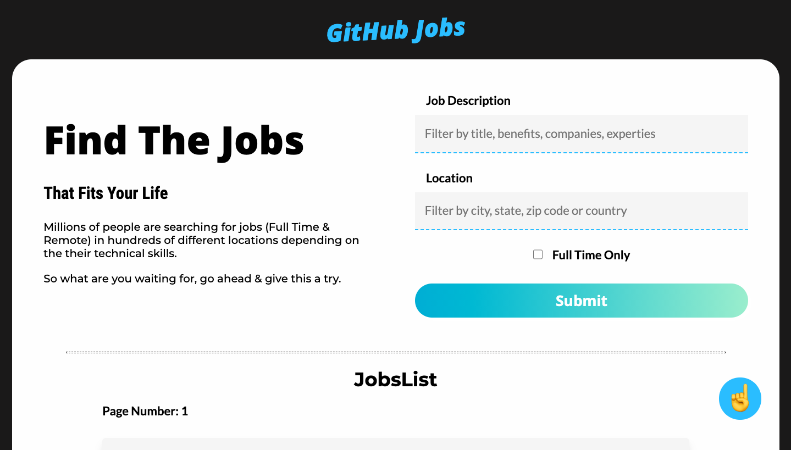
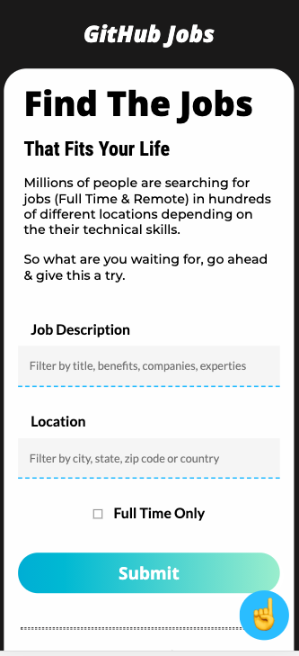
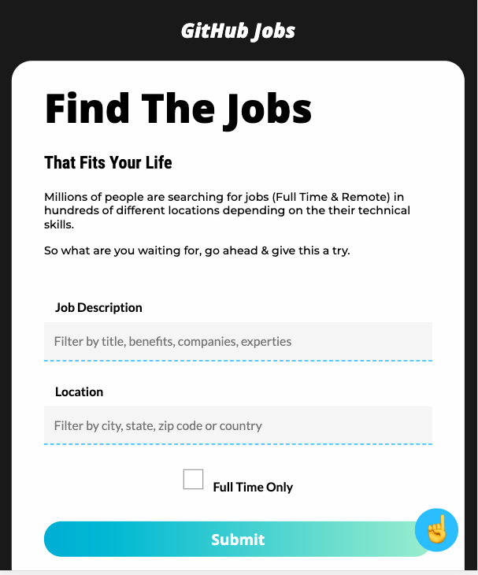
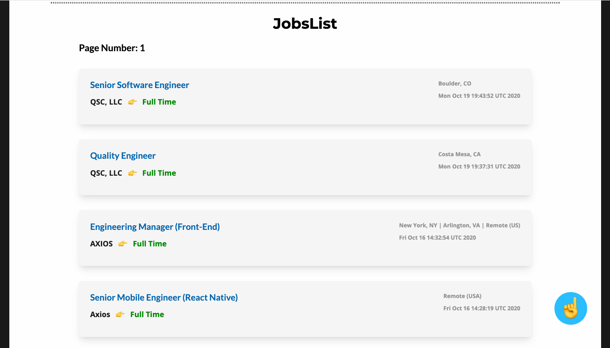
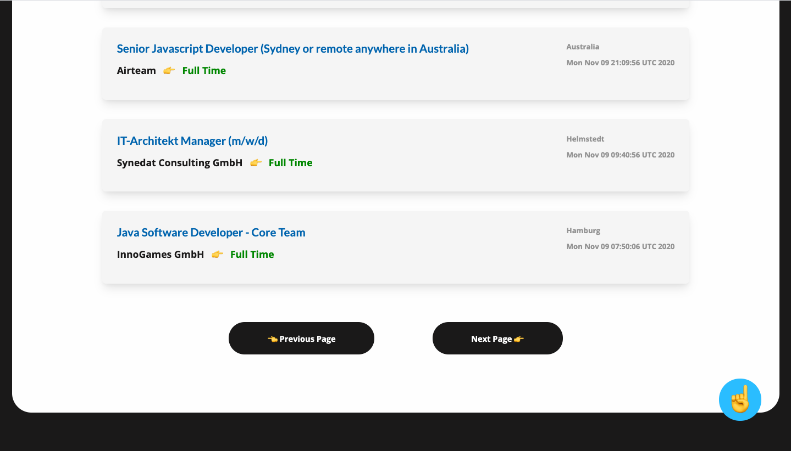
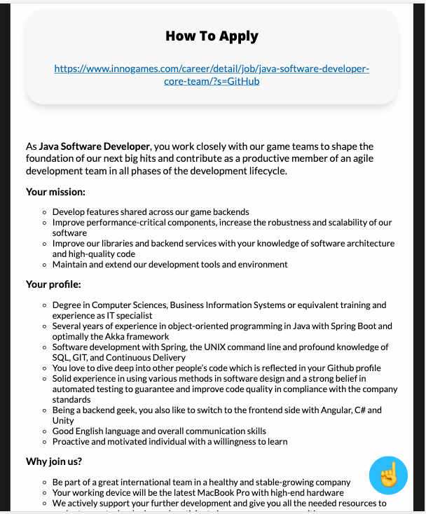

# GitHub Jobs

&nbsp;&nbsp;&nbsp;&nbsp;&nbsp;&nbsp;   &nbsp;&nbsp;&nbsp;&nbsp;  &nbsp;&nbsp;&nbsp;&nbsp;&nbsp;&nbsp;   

## 🎯 Project goal
- The project was to create a responsive and beautiful web app with API integration which can be used to find software jobs by location and skills.

## 🔥 Features/Services it provides
- 👉 API integration
- 👉 Beautiful, modern and responsive web UI
- 👉 The frontend is interactive and client side rendered
- 👉 Users can find jobs depending on location and skills

## 🍕 Solution
- ✅  React is used for frontend and Sass is used for styling
- ✅  For frontend UI design Figma is used
- ✅  GitHub's public api is used for data

## 🎥 Images

